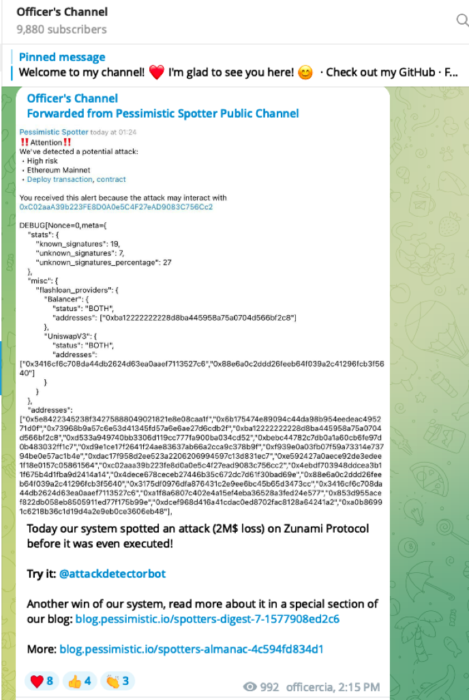
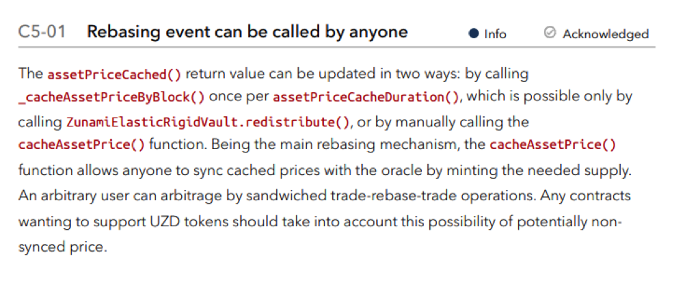

# Zunami Exploit POC using Foundry

## Executive Summary: Zunami Protocol Exploit

**Date: August 13, 2023**

### Event: Zunami Protocol Exploit

## Overview:
On August 13, 2023, the Zunami Protocol, a decentralized platform known for producing aggregated stablecoins (UZD and zETH), was exploited twice by an attacker. This report is a detailed explanation of the root causes and vulnerabilities that led to the exploit as well as recommendations I would make to Zunami Protocol if they were a client.

### Key Details:

Attacker’s Address: 0x5f4c21c9bb73c8b4a296cc256c0cde324db146df

Attack Contract: 0xa21a2b59d80dc42d332f778cbb9ea127100e5d75

Targeted Contract: 0xe47f1cd2a37c6fe69e3501ae45eca263c5a87b2b

### Attack Transactions:
#### zETH Attack TX: 

[Etherscan](https://etherscan.io/tx/0x2aec4fdb2a09ad4269a410f2c770737626fb62c54e0fa8ac25e8582d4b690cca) 

[0x2aec4fdb2a09ad4269 | Phalcon](https://explorer.phalcon.xyz/tx/eth/0x2aec4fdb2a09ad4269a410f2c770737626fb62c54e0fa8ac25e8582d4b690cca)

#### UZD Attack TX: 

[Etherscan](https://etherscan.io/tx/0x0788ba222970c7c68a738b0e08fb197e669e61f9b226ceec4cab9b85abe8cceb)  

[0x0788ba222970c7c68a | Phalcon](https://explorer.phalcon.xyz/tx/eth/0x0788ba222970c7c68a738b0e08fb197e669e61f9b226ceec4cab9b85abe8cceb)

Total Stolen Amount in zETH Exploit:  26.337 ETH 

Total Stolen Amount in UZD Exploit:  1,152.939 ETH & 1,265.457 USDT


### Background on Zunami Protocol:

Zunami Protocol is decentralized stablecoin yield aggregator. The protocol currently issues two stable coins, UZD and zETH, and works with Curve pools and Stake DAO/Convex MIM, XAIFRAXBP, alUSDFRAXBP pools.

Source: [FAQ - Zunami Protocol Docs](https://zunamilab.gitbook.io/zunami-protocol-docs/protocol-overview/faq)

---
## Timeline of Events: Zunami Protocol zETH Exploit

1. **Initial Funding:** The attacker's EOA (Externally Owned Account) receives a funding of 9.95 ETH through Tornado Cash.

2. **Deployment:** The attacker deploys the attacking contract on the Ethereum network.

3. **Flashloan Acquisition:** The attacking contract procures a flashloan of 6811 wETH from Balancer.

4. **zETH Acquisition:** Using the ETH/frxETH and zETH/frxETH pools on Curve, the attacking contract exchanges 300 ETH to obtain 84 zETH.

5. **CRV Manipulation:** The attacking contract trades 11 wETH for 35293 CRV and subsequently transfers this CRV to the sEthFraxEthCurveConvex contract.

6. **Price Alteration:** Through repeated exchanges of 406 wETH for CRV in the wETH/CRV pool, the attacking contract modifies the wETH/CRV price ratio from 406/1111 to 406/105.

7. **Asset Price Storage:** The `zETH.cacheAssetPrice` function is invoked to record the prevailing asset price.

8. **zETH Balance Increase:** Due to the prior manipulations, the zETH balance of the attacking contract surges from an initial 84 zETH to 221 zETH.

9. **zETH to frxETH Exchange:** The accumulated 221 zETH is traded for 389 frxETH.

10. **Reversal of wETH/CRV Exchanges:** The prior wETH/CRV exchanges are undone, starting with a wETH/CRV price of 399/105 and concluding at a price of 409/1111.

11. **frxETH to wETH Conversion:** The frxETH is traded back for wETH.

12. **Flashloan Repayment:** The attacking contract repays the flashloan. 

13. **Profit Transfer:** The residual balance, which amounts to 26 ETH, is sent back to the attacker's EOA. This amount is subsequently laundered through Tornado Cash.

Source: [0x2aec4fdb2a09ad4269 | Phalcon](https://explorer.phalcon.xyz/tx/eth/0x2aec4fdb2a09ad4269a410f2c770737626fb62c54e0fa8ac25e8582d4b690cca?line=651)

---
## Timeline of Events: Zunami Protocol UZD Exploit

The same attacking contract from the zETH attack is utilized.

1. **Flashloan Acquisition:** The attacking contract procures flash loans of $7 million USDT from Uniswap V3 and another of $7 million USDC and 10,011 WETH from Balancer.
   
   **Balances Post-Flashloan:**
   - USDC: 7,000,000 
   - USDT: 7,000,000 
   - wETH: 10,011

3. **Liquidity Addition to Curve:** The attacker adds liquidity to Curve using $5.75 million USDC, receiving approximately 5,746,896 crvFRAX.

   **Balances** 
   - USDC: 1,250,000 
   - USDT: 7,000,000 
   - wETH: 10,011
   - crvFRAX: 5,746,896

4. **UZD Acquisition:** The attacker swaps the crvFRAX for approximately 4,082,046 UZD using the UZD/FRAXBP pool. Additionally, the remaining $1.25 million USDC is swapped for 791,280 UZD using the crvUSD/UZD and crvUSD/USDC pools.

   **Balances**
   - USDT: 7,000,000 
   - wETH: 10,011
   - UZD: 4,873,326

5. **SDT Acquisition and Transfer:** The attacker swaps 11 WETH for 55,981 SDT using the Curve SDT/ETH pool and subsequently transfers all of the 55,598 SDT into the 0x9848_MIMCurveStakeDao contract.

   **Balances**
   - USDT: 7,000,000 
   - wETH: 10,000
   - UZD: 4,873,326

6. **SushiSwap Transactions:** The attacker uses SushiSwap to swap 10,000 WETH for 58,043 SDT and swap 7 million USDT for 2,154 wETH.

   **Balances**
   - wETH: 2,154
   - UZD: 4,873,326
   - SDT: 58,043

7. **Asset Price Caching:** The `UZD.cacheAssetPrice` function is invoked to record the current asset price.

8. **SushiSwap Transactions:** The attacker then reverses SDT/wETH and wETH/USDT transfers from step 6..

9. **UZD Balance Manipulation:** The attacking contact now calls the UZD contract's `balanceOf` function. The function uses the cached price which has been temporarily inflated due to the prior manipulations. This results in a UZD balance of 16,902,957.

   **Balances After Manipulation:**
   - USDT: 6,976,034
   - wETH: 9,999.341
   - UZD: 16,902,957

9. **UZD to crvFRAX Exchange:** 14,158,424 UZD is exchanged for 7,281,124 crvFRAX. The remaining 2,744,533 UZD is exchanged for 1,891,351 crvUSD.

   **Balances**
   - USDT: 6,976,034
   - wETH: 9,999.341
   - crvFRAX: 7,281,124 
   - crvUSD: 1,891,351 

10. **Liquidity Removal and Exchanges:** 
The attacking contract sends the 7,281,124 crvFRAX back to Curve, removing liquidity and receiving 5,515,624 FRAX and 1,776,128 USDC in return.
Then the attacking contract exchanges 5,515,624 FRAX for 5,507,731 USDC and exchanges the remaining crvUSD balance of 1,891,351 for 1,890,364 USDC.

   **Balances**
   - USDT: 6,976,034
   - USDC: 9,174,223
   - wETH: 9,999

11. **Flashloan Repayment Prep:** 25,920 USDC is exchanged for 25,941 USDT via the Curve DAI/USDC/USDT Pool and 2,148,304 USDC for 1,164 wETH is exchanged via Uniswap.

   **Balances**
   - USDT: 7,001,975
   - USDC: 7,000,000
   - wETH: 11,163

12. **Flashloan Repayment:** The attacker repays the flash loans, resulting in:
   - USDT: 1,265
   - USDC: 0
   - wETH: 1,152

13. **Profit Transfer:** The remaining balances are transferred back to the attacker's EOA and subsequently transferred to Tornado Cash.

Source : [0x0788ba222970c7c68a | Phalcon](https://explorer.phalcon.xyz/tx/eth/0x0788ba222970c7c68a738b0e08fb197e669e61f9b226ceec4cab9b85abe8cceb?line=800)

### Root Causes and Recommendations 

#### Dependence on Spot Prices and Self-implemented Price Oracles:
Zunami's reliance on spot prices and its decision to use a self-implemented price oracle made it susceptible to price manipulation. The impact of large trades and flash loan attacks could be mitigated or blunted somewhat by utilizing a more robust and decentralized oracle system based on Volume-Weighted Average Prices (VWAP) or Time-Weighted Average Prices (TWAP). A decentralized oracle system like Chainlink would have amalgamated price and volume data from various sources, reducing the chances of price manipulation.

#### Reliance on Cached Prices:
Cached prices, while efficient, can be outdated and may not reflect the current market conditions. The Zunami Protocol's use of cached prices meant that if an attacker could manipulate the price at the time of caching, they could exploit the system until the cache was updated. This provided a window of opportunity for malicious actors to act.

#### Anyone Can Cache Prices at Anytime:
Allowing anyone to cache prices without restrictions amplified the vulnerability associated with cached prices. It meant that an attacker could intentionally cache a manipulated price, ensuring that their desired price was the one used by the protocol, further facilitating their exploit.

#### Incorrect Price Calculation from Donations: 
The system had a flaw where donations to CurveConvexStratBase and MIMCurveStakeDao were causing incorrect price calculations.  As price is partially derived from the ratio of assets in these contacts, an attacker that can artificially skewed this ration, can get incorrect and very favorable price calculations.

#### Lack of Logging and Monitoring:
Without adequate logging and monitoring mechanisms, malicious activities can go unnoticed until it's too late. In the case of the Zunami Protocol, the absence of real-time monitoring meant that the protocol couldn't detect or respond to the first attack and prevent the second and larger attack. This gave the attacker time (approx 8 mins) to exploit both stablecoins and modify attack strategies based on the outcome for the first attack. 

#### Lack of Blacklists or Pausable Contracts:
Blacklists and pausable contracts serve as emergency brakes in the event of detected malicious activity. The Zunami Protocol's lack of these safety measures meant that once the exploit was detected, there was no immediate way to halt the attacker's actions or prevent further damage. Implementing such features would have allowed the protocol to temporarily halt all activities, investigate the issue, and take corrective actions.

Some chain monitoring companies have provided evidence on Twitter and Telegram (see below) that their systems spotted the attack before it was even executed.



Source: [Telegram: Contact @officer_cia](https://t.me/officer_cia/1614)

#### Negligence of Security Warnings:
Zunami has an unfortunate tendency to simply acknowledge vulnerabilities rather than fix them, even for vulnerabilities rated "High" severity by security professionals. For instance, 

As noted in the code comments and in a Feb 2023 [UZD Audit by HashEx](https://github.com/HashEx/public_audits/blob/master/Zunami%20Stable%20%28UZD%29/Zunami%20Stable%20%28UZD%29.pdf),:



#### Rebasing event can be called by anyone
The assetPriceCached() return value can be updated in two ways: by calling _cacheAssetPriceBylock() once per assetPriceCacheDuration), which is possible only by calling ZunamiElasticRigidVault. redistribute(), or by manually calling the cacheAssetPrice() function. Being the main rebasing mechanism, the cacheAssetPrice()
function allows anyone to sync cached prices with the oracle by minting the needed supply.
**An arbitrary user can arbitrage by sandwiched trade-rebase-trade operations. Any contracts wanting to support UZD tokens should take into account this possibility of potentially non-synced price.** ```

SlowMist claims to have identified this risk back in June but didn't receive a proper response from Zunami:


Source: [Telegram: Contact @ETHSecurity](https://t.me/ETHSecurity/73088)



Source [Twitter/X.com](https://twitter.com/evilcos/status/1690894655150555136)

Others issues addressed in the two audits such as the lack of events for important state changes contributed to the lack of logging and monitoring in the protocol.
In conclusion, the combination of these six issues created a perfect storm that made the Zunami Protocol vulnerable to the two hacks. Addressing any one of these issues might have reduced the risk, but addressing all of them would have significantly fortified the protocol against such exploits.

-----

## Installation and usage

- Follow the [instructions](https://book.getfoundry.sh/getting-started/installation.html) to install [Foundry](https://github.com/foundry-rs/foundry).

- Clone and install dependencies:`git submodule update --init --recursive`

Test

```
forge test --contracts ./src/test/Zunami_exp.sol --evm-version 'shanghai' -vvv
```

#### Contract

[Zunami_exp.sol](src/test/Zunami_exp.sol)

#### Link Reference

https://twitter.com/peckshield/status/1690877589005778945

https://twitter.com/BlockSecTeam/status/1690931111776358400

Credit: https://github.com/SunWeb3Sec/DeFiHackLabs#20230814-zunamiprotocol---price-manipulation
